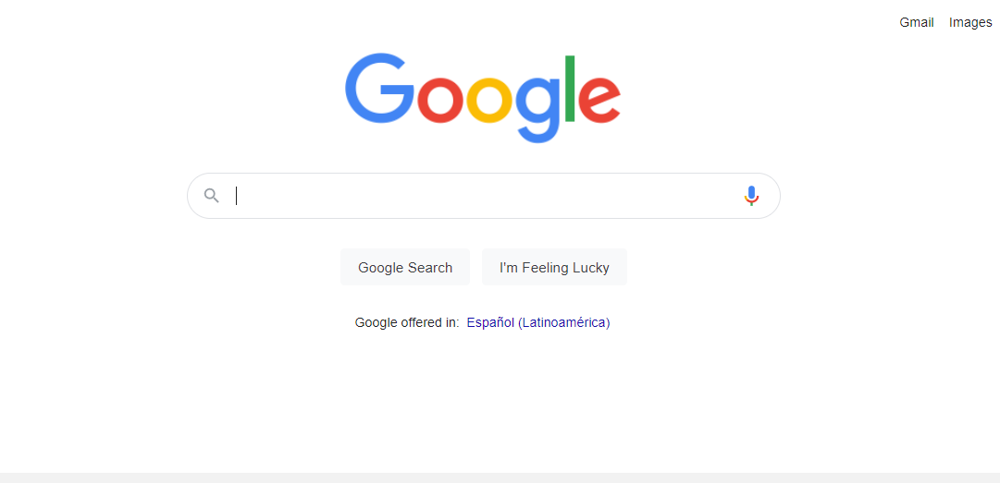
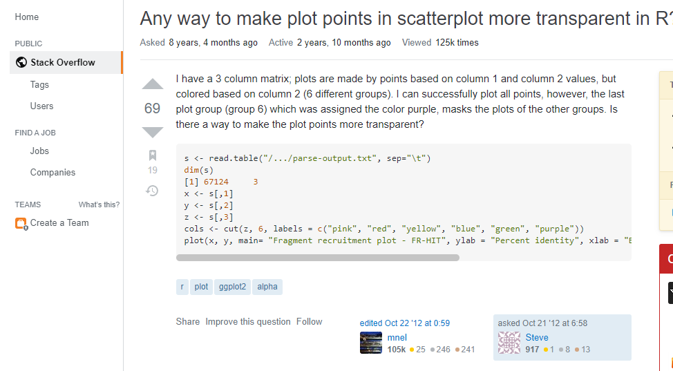

```{r setup, include=FALSE}
options(htmltools.dir.version = FALSE,
        message = FALSE,
        warning = FALSE)
library(xaringanthemer)
library(xaringanExtra)
library(tidyverse)
library(knitr)
library(icon)
library(kableExtra)
library(nomnoml)
```

```{r xaringan-themer, include=FALSE, warning=FALSE}
xaringanExtra::use_logo(
  image_url = "https://raw.githubusercontent.com/rstudio/hex-stickers/master/PNG/xaringan.png"
)
xaringanExtra::use_panelset()
xaringanExtra::use_broadcast()
xaringanExtra::use_share_again()
#xaringanExtra::style_share_again(share_buttons = c("twitter", "linkedin"))
xaringanExtra::use_tachyons()
xaringanExtra::use_fit_screen()
xaringanExtra::use_tile_view() # O
style_mono_accent(
  base_color = "#0dc96f",
  background_color = "#ffffff",
  inverse_background_color = "#562457",
  header_color = "#562457",
  inverse_header_color = "#ffffff", 
  inverse_text_color = "#ffffff",
  code_inline_color = "#179c55",
  link_color= "#A406B2",
  text_font_size = "25px",
  header_font_google = google_font("Roboto", "Medium", "500"), #Popper
  text_font_google   = google_font("Lora", "Regular", "400"),
  code_font_google   = google_font("Fira Mono"),
  )
```

```{r metathis, echo=FALSE}
library(metathis)
meta() %>%
  meta_name("github-repo" = "flor14/rladies-jujuy") %>% 
  meta_social(
    title = "Data Visualization I",
    description = paste(
      "an introduction to ggplot2", 
      "and other visualizacion packages"
    ),
    url = "https://https://flor14.github.io/toronto_data_workshop/what_i_learned_from_reprohack.html#1",
    image = "https://res.cloudinary.com/flor/image/upload/v1614305498/75581_l4kohr.jpg",
    image_alt = paste(
      "Florencia D'Andrea",
      "March 2021"
      ),
    og_type = "website",
    og_author = "Florencia D'Andrea",
    twitter_card_type = "summary_large_image",
    twitter_creator = "@cantoflor_87",
    twitter_site = "@cantoflor_87"
  )
```


### Learning objectives (15' class)

The students should...

* ...understand that `ggplot2::ggplot()` and `plot()` are two of the possible functions to plot in R, and that in this course we will focus on the first one.

* ...recognize that Tidyverse and base R have different R syntax 

---

### The students are familiar with...

* Basics of R programming
* RStudio IDE
* RMarkdown
* The use of R packages
* Tidyverse

---

background-image: url(images/cuadrados.png)
background-size: cover
class: bottom


.bg-washed-green.b--dark-green.ba.bw2.br3.shadow-5.ph4.mt5[
## Data Visualization I
#### Lesson 1: Orientation to statistical graphics

]

---


## Data Science


```{r,echo = FALSE, out.width=650, fig.align='center'}
knitr::include_graphics("images/data.png")
```

.footnote[[R for Data Science](https://r4ds.had.co.nz/explore-intro.html)]
---

class: center, middle


.pull-left[

```{r plot, fig.height=5, fig.width=5, echo=FALSE}
plot(diamonds$carat, diamonds$price)
```

]

.pull-right[

```{r ggplot, fig.height=5, fig.width=5, echo=FALSE}
ggplot(diamonds, aes(x=carat, y=price))+
  geom_point()
```

]
---

.pull-left[

```{r plot2, fig.height=4, fig.width=4, echo=FALSE}
plot(diamonds$carat, diamonds$price)
```

]

.pull-right[

```{r ggplot2, fig.height=4, fig.width=4, echo=FALSE}
ggplot(diamonds, aes(x=carat, y=price))+
  geom_point()
```
]


#### Which one of these statements is true?

--

**A.** These plots were made with different programming languages.

--

**B.** Both are made with R.

--

**C.** None of the above.

---

.pull-left[

```{r plot5, fig.height=4, fig.width=4, echo=FALSE}
plot(diamonds$carat, diamonds$price)
```

]

.pull-right[

```{r ggplot5, fig.height=4, fig.width=4, echo=FALSE}
ggplot(diamonds, aes(x=carat, y=price))+
  geom_point()
```

]

#### Which one of these statements is true?

**A.** These plots were made with different programming languages.


<span style="background-color: lightblue">**B.** Both plots were made with R.</mark>


**C.** None of the above.

---

.pull-left[

```{r plot4, fig.height=4, fig.width=4, echo=FALSE}
plot(diamonds$carat, diamonds$price)
```

####`plot()`

]

.pull-right[

```{r ggplot44, fig.height=4, fig.width=4, echo=FALSE}
ggplot(diamonds, aes(x=carat, y=price))+
  geom_point()
```

####`ggplot2::ggplot()`


]
  
#### <pre class="tab">base R                         tidyverse</pre>

<span style="background-color: lightblue">**B.** Both are made with R.</mark>

---

class: middle, center


.pull-left[

```{r, echo = FALSE, fig.align='center', out.width=250}
knitr::include_graphics("images/hex.png")
```

]

.pull-right[

```{r ggplot4, fig.height=4, fig.width=4, echo=FALSE}
ggplot(diamonds, aes(x=carat, y=price))+
  geom_point()
```

]

#### `ggplot2` is the plotting package of the `tidyverse`

---

## Tidyverse 

Opinionated collection of **R packages** designed for data science


```{r tidy,echo = FALSE, fig.align='center'}
knitr::include_graphics("images/tidytools.png")
```


.footnote[[Tidyverse webpage](https://www.tidyverse.org/)]


---

class: inverse, middle, center

## Live coding #1

#### `plot()` and `ggplot()`

---

.pull-left[

#### Base R syntax

```{r plot14, fig.height=4, fig.width=4}
plot(diamonds$carat, 
     diamonds$price)
```

]

.pull-right[

#### Tidyverse syntax

```{r ggplot14, fig.height=4, fig.width=4}
ggplot(diamonds,
       aes(x=carat, 
           y=price))+
  geom_point()
```
]


---

class: middle, center, inverse


### In this course we are going to use `ggplot2` 

---


### Why to use `ggplot2`?


.pull-left[

* once fluent, can make most plots up to **publication quality standard** very quickly.

* Layered grammar of graphics

* Package maintained by RStudio

]

.pull-right[

```{r ggplot11, fig.height=4, fig.width=4, echo=FALSE, message = FALSE, warning = FALSE}
ggplot(diamonds, aes(x = carat, y = price, col = cut)) +
    geom_point(alpha = 0.2) +
    scale_color_viridis_d(direction = -1) +
    geom_smooth(method = "gam")+
    theme_classic()
```

]


---

## Example

Maybe I can make the points more transparent?


```{r ggplot21, fig.height=4, fig.width=4, echo=FALSE}
ggplot(diamonds, aes(x=carat, y=price))+
  geom_point()
```


---

class: middle, center

```{r google,echo = FALSE, fig.align='center'}

```

---

#### Question

```{r pregunta,echo = FALSE, fig.align='center'}

```

---

#### Answer 1

```{r,echo = FALSE, fig.align='center'}
knitr::include_graphics("images/stack1.png")
```


.footnote[[Any way to make plot points in scatterplot more transparent in R?](https://stackoverflow.com/questions/12995683/any-way-to-make-plot-points-in-scatterplot-more-transparent-in-r)]
---

#### Answer 2

```{r,echo = FALSE, fig.align='center'}
knitr::include_graphics("images/stack2.png")
```


.footnote[[Any way to make plot points in scatterplot more transparent in R?](https://stackoverflow.com/questions/12995683/any-way-to-make-plot-points-in-scatterplot-more-transparent-in-r)]
---

.pull-left[

```{r plot3, fig.height=4, fig.width=4, include=FALSE}
plot(diamonds$carat, diamonds$price)
```

]


---


## Some tips for searching information on the web

* To make your search more specific, clarify if you are looking for a solution within the tidyverse packages.


* The newer the post, the better.

--

### This is practice! 🙌 

---


background-image: url(images/cuadrados.png)
background-size: cover

.bg-washed-green.b--dark-green.ba.bw2.br3.shadow-5.ph4.mt5[

### Books

* Wickham, H., & Grolemund, G. (2016). [R for data science: import, tidy, transform, visualize, and model data.](https://r4ds.had.co.nz/) O'Reilly Media, Inc.

* Wickham, H. (2016). [Ggplot2: Elegant graphics for data analysis.](https://ggplot2-book.org/) Springer, 2016.

*  https://datacarpentry.org/R-ecology-lesson/04-visualization-ggplot2.html

* Wickham, H. (2010). [A layered grammar of graphics](http://vita.had.co.nz/papers/layered-grammar.pdf). Journal of Computational and Graphical Statistics, 19(1), 3-28.
]


---

background-image: url(images/cuadrados.png)
background-size: cover

.bg-washed-green.b--dark-green.ba.bw2.br3.shadow-5.ph4.mt5[

### Blogposts

* [Why I don't use ggplot2](https://simplystatistics.org/2016/02/11/why-i-dont-use-ggplot2/) - Jeff Leek

* [Why I use ggplot2](http://varianceexplained.org/r/why-I-use-ggplot2/) - David Robinson

* [Comparing ggplot2 and R Base Graphics](https://flowingdata.com/2016/03/22/comparing-ggplot2-and-r-base-graphics/) - Nathan Yau
]


