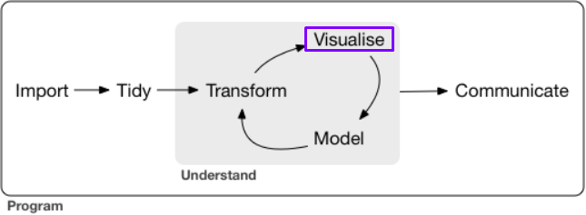
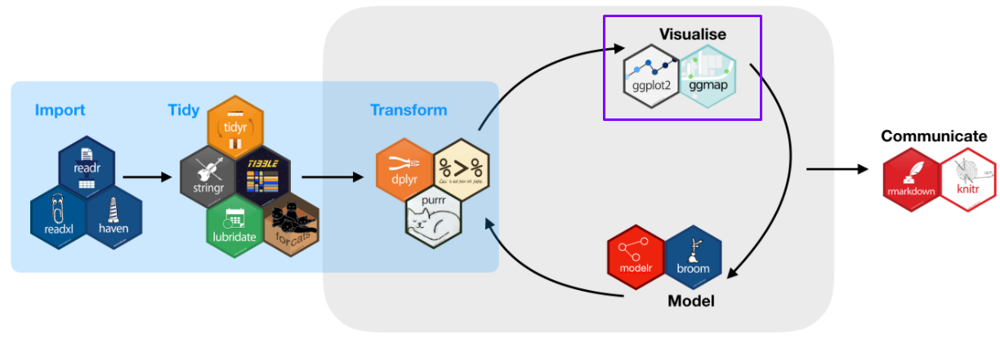
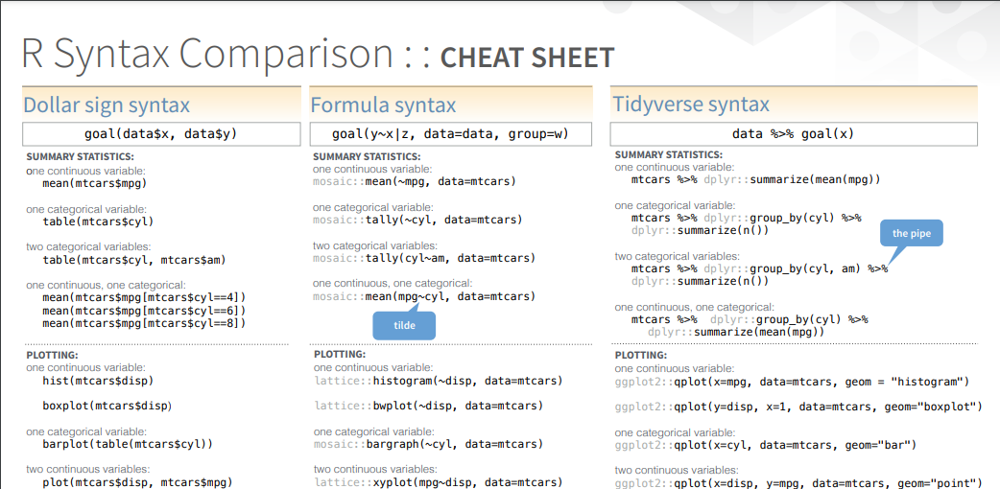
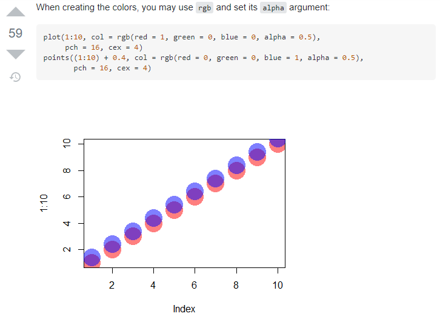
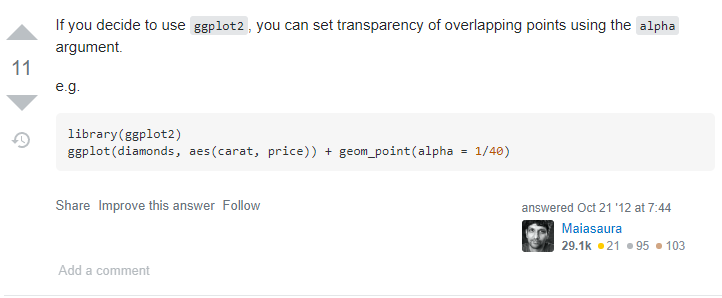

```{r setup, include=FALSE}
options(htmltools.dir.version = FALSE)
library(xaringanthemer)
library(xaringanExtra)
library(tidyverse)
library(knitr)
library(icon)
library(kableExtra)
library(nomnoml)
```

```{r xaringan-themer, include=FALSE, warning=FALSE}
xaringanExtra::use_logo(
  image_url = "https://raw.githubusercontent.com/rstudio/hex-stickers/master/PNG/xaringan.png"
)
xaringanExtra::use_panelset()
xaringanExtra::use_broadcast()
xaringanExtra::use_share_again()
#xaringanExtra::style_share_again(share_buttons = c("twitter", "linkedin"))
xaringanExtra::use_tachyons()
xaringanExtra::use_fit_screen()
xaringanExtra::use_tile_view() # O
style_mono_accent(
  base_color = "#0dc96f",
  background_color = "#ffffff",
  inverse_background_color = "#562457",
  header_color = "#562457",
  inverse_header_color = "#ffffff", 
  inverse_text_color = "#ffffff",
  code_inline_color = "#179c55",
  link_color= "#A406B2",
  text_font_size = "25px",
  header_font_google = google_font("Roboto", "Medium", "500"), #Popper
  text_font_google   = google_font("Lora", "Regular", "400"),
  code_font_google   = google_font("Fira Mono"),
  )
```

```{r metathis, echo=FALSE}
library(metathis)
meta() %>%
  meta_name("github-repo" = "flor14/rladies-jujuy") %>% 
  meta_social(
    title = "Data Visualization I",
    description = paste(
      "an introduction to ggplot2", 
      "and other visualizacion packages"
    ),
    url = "https://https://flor14.github.io/toronto_data_workshop/what_i_learned_from_reprohack.html#1",
    image = "https://res.cloudinary.com/flor/image/upload/v1614305498/75581_l4kohr.jpg",
    image_alt = paste(
      "Florencia D'Andrea",
      "March 2021"
      ),
    og_type = "website",
    og_author = "Florencia D'Andrea",
    twitter_card_type = "summary_large_image",
    twitter_creator = "@cantoflor_87",
    twitter_site = "@cantoflor_87"
  )
```


### Objectives of this 15' class

* Recognize that `ggplot()` is one of the possible functions to plot in R
* Understand that `ggplot2` is a tidyverse package and presents a particular syntax

--

### The students are familiar with...

* Basics of R programming
* RStudio IDE
* RMarkdown
* The use of R packages

---

background-image: url(images/cuadrados.png)
background-size: cover
class: bottom


.bg-washed-green.b--dark-green.ba.bw2.br3.shadow-5.ph4.mt5[
## Data Visualization 
#### Class 1: Introduction the `ggplot2` package 

]

---

## Data Science


```{r,echo = FALSE, out.width=550}

```

.footnote[[R for Data Science](https://r4ds.had.co.nz/explore-intro.html)]
---

class: center, middle


.pull-left[

```{r plot, fig.height=5, fig.width=5, echo=FALSE}
plot(diamonds$carat, diamonds$price)
```

]

.pull-right[

```{r ggplot, fig.height=5, fig.width=5, echo=FALSE}
ggplot(diamonds, aes(x=carat, y=price))+
  geom_point()
```

]
---

.pull-left[

```{r plot2, fig.height=4, fig.width=4, echo=FALSE}
plot(diamonds$carat, diamonds$price)
```

]

.pull-right[

```{r ggplot2, fig.height=4, fig.width=4, echo=FALSE}
ggplot(diamonds, aes(x=carat, y=price))+
  geom_point()
```
]


#### Which one of these statements is true?

--

**A.** These plots were made with different programming languages.

--

**B.** Both are made with R.

--

**C.** Only the graph on the right was made with R.

--

**D.** None of the above.

---

.pull-left[

```{r plot5, fig.height=4, fig.width=4, echo=FALSE}
plot(diamonds$carat, diamonds$price)
```

]

.pull-right[

```{r ggplot5, fig.height=4, fig.width=4, echo=FALSE}
ggplot(diamonds, aes(x=carat, y=price))+
  geom_point()
```

]

#### Which one of these statements is true?

**A.** These plots were made with different programming languages.


<span style="background-color: lightblue">**B.** Both plots were made with R.</mark>


**C.** Only the graph on the right was made with R.


**D.** None of the above.

---

.pull-left[

```{r plot4, fig.height=4, fig.width=4, echo=FALSE}
plot(diamonds$carat, diamonds$price)
```

####`plot()`

]

.pull-right[

```{r ggplot4, fig.height=4, fig.width=4, echo=FALSE}
ggplot(diamonds, aes(x=carat, y=price))+
  geom_point()
```

####`ggplot2::ggplot()`


]

    📈     
#### <pre class="tab">base R      tidyverse</pre>

<span style="background-color: lightblue">**B.** Both are made with R.</mark>

.footnote[Other examples  [here](https://flowingdata.com/2016/03/22/comparing-ggplot2-and-r-base-graphics/)]

---

## Tidyverse packages

* Opinionated collection of **R packages** designed for data science


```{r tidy,echo = FALSE, fig.align='center'}

```


.footnote[[Tidyverse webpage](https://www.tidyverse.org/)]

---


```{r, echo = FALSE, fig.align='center', out.width=250}
knitr::include_graphics("images/hex.png")
```

#### `ggplot2` is the plotting package of the `tidyverse`
---

class: middle, center

.pull-left[

```{r plot6, fig.height=4, fig.width=4, echo=FALSE}
plot(diamonds$carat, diamonds$price)
```

]

.pull-right[

```{r ggplot6, fig.height=4, fig.width=4, echo=FALSE}
ggplot(diamonds, aes(x=carat, y=price))+
  geom_point()
```

]

### Let's have a look at the code

---

class: inverse, middle, center


## Live coding #1


---

## There are multiple and equally valid R syntaxes. 

```{r syntax,echo = FALSE, fig.align='center'}

```

.footnote[[R Syntax Comparison - Amalia McNamara](https://www.amelia.mn/Syntax-cheatsheet.pdf)

---

.pull-left[

**dollar sign / base R syntax**
base R functions


* dataset$variablename

* square bracket subsetting
dataset[1,2].

]

.pull-right[

**tidyverse syntax** 
`dplyr`, `tidyr`, and more. 

These functions expect data to be the first argument,
which allows them to work with the “pipe” (**%>%**) from the
`magrittr` package. 

`ggplot2` has a 
]

---

```{r ggplot9, fig.height=4, fig.width=4}
library(dplyr)
library(ggplot2)

diamonds %>% 
  mutate(price = price*1000) %>% 
  filter(cut == "Premium") %>% 
  ggplot(aes(x = carat, y = price, color = clarity))+
  scale_color_viridis_d()+
  geom_point()+
  theme_bw()
```

---

## Tidyverse syntax
#### `ggplot2` uses plus signs (**+**) to string pieces together

```{r ggplot10, fig.height=4, fig.width=4}
library(dplyr)
library(ggplot2)

diamonds %>% 
  mutate(price = price*1000) %>% 
  filter(cut == "Premium") %>% 
  ggplot(aes(x = carat, y = price, color = clarity))+
  scale_color_viridis_d()+
  geom_point()+
  theme_bw()
```


---

class: middle, inverse

### Why it is important to be aware of syntax differences?


---


```{r,echo = FALSE, fig.align='center'}

```


.footnote[[Any way to make plot points in scatterplot more transparent in R?](https://stackoverflow.com/questions/12995683/any-way-to-make-plot-points-in-scatterplot-more-transparent-in-r)]
---

```{r,echo = FALSE, fig.align='center'}

```


.footnote[[Any way to make plot points in scatterplot more transparent in R?](https://stackoverflow.com/questions/12995683/any-way-to-make-plot-points-in-scatterplot-more-transparent-in-r)]
---

.pull-left[

```{r plot3, fig.height=4, fig.width=4, include=FALSE}
plot(diamonds$carat, diamonds$price)
```

]


---


---

## Take home messages

* There are different R syntaxes. 


---

background-image: url(images/cuadrados.png)
background-size: cover

.bg-washed-green.b--dark-green.ba.bw2.br3.shadow-5.ph4.mt5[

### Books

* Wickham, H., & Grolemund, G. (2016). [R for data science: import, tidy, transform, visualize, and model data.](https://r4ds.had.co.nz/) O'Reilly Media, Inc.

* Wickham, H. (2016). [Ggplot2: Elegant graphics for data analysis.](https://ggplot2-book.org/) Springer, 2016.

*  https://datacarpentry.org/R-ecology-lesson/04-visualization-ggplot2.html
]


---

background-image: url(images/cuadrados.png)
background-size: cover

.bg-washed-green.b--dark-green.ba.bw2.br3.shadow-5.ph4.mt5[

### Blogposts

* [Why I don't use ggplot2](https://simplystatistics.org/2016/02/11/why-i-dont-use-ggplot2/) - Jeff Leek

* [Why I use ggplot2](http://varianceexplained.org/r/why-I-use-ggplot2/) - David Robinson

* [Comparing ggplot2 and R Base Graphics](https://flowingdata.com/2016/03/22/comparing-ggplot2-and-r-base-graphics/) - Nathan Yau
]

---

#### Could you say which of these statements do you think is more appropriate?

--
**A.** These graphics were made with different softwares.

--
**B.** Both are made with R, only the graph on the right has more details.

--
**C.** Only the graph on the right was made with R.

--
**D.** None of the above.


---

#### Could you say which of these statements do you think is more appropriate?


**A.** These graphics were made with different softwares.

This is the *common sense* answer

**Epistemological obstacle**
> There is only one way to plot with R

**Potential problem**
* It is likely that student doesn't know about the Tidyverse

**Concept to work**
* There may be several different ways to produce equivalent results using the same programming language.
* This preconception can cause problems when you want to find information about graphics with R on the web.


Other option could be:
One of this graphics is python and the other is R

---

#### Could you say which of these statements do you think is more appropriate?


**B.** Both are made with R.

This is the correct answer

The students...
* ...are aware that you can make different plots using R
* ...not necessarily know about the Tidyverse.

**Concept to work**
Let's make explicit that ggplot is one of the Tidyverse packages.

```{nomnoml}
# stroke: orange
#.box: fill=#8f8 visual=ellipse

[ggplot2 package]-[tidyverse]
[base r]-[<box>R]
[tidyverse]-[<box>R]
[`plot()`]-[base r]
[`ggplot()`]-[ggplot2 package]

```


---

#### Could you say which of these statements do you think is more appropriate?


**C.** Only the graph on the right was made with R.


Students only recognize ggplot as the R plots.

Probably students answering this are familiarized with the Tidyverse, but they do not know that basically ggplot is build from R base code and that there are other ways to 

---

#### Could you say which of these statements do you think is more appropriate?


**D.** Other:

 Are there any options that I am not considering? Let's listen to the students


