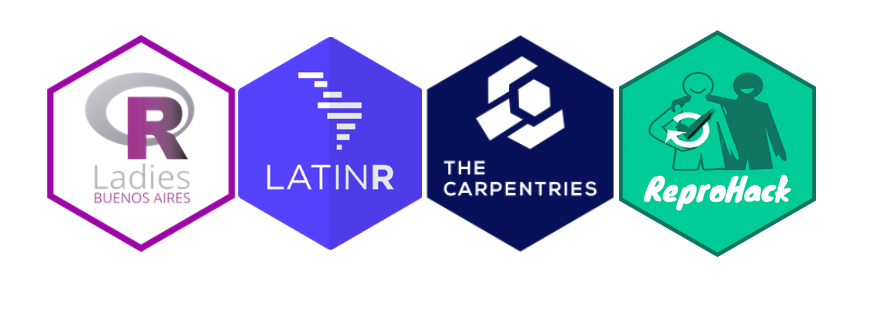

```{r setup, include=FALSE}
options(htmltools.dir.version = FALSE,
        message = FALSE,
        warning = FALSE)
library(xaringanthemer)
library(xaringanExtra)
library(tidyverse)
library(icons)
library(knitr)
library(nomnoml)
```

```{r xaringan-themer, include=FALSE, warning=FALSE}
xaringanExtra::use_logo(
  image_url = "https://raw.githubusercontent.com/rstudio/hex-stickers/master/PNG/xaringan.png"
)
xaringanExtra::use_panelset()
xaringanExtra::use_broadcast()
xaringanExtra::use_share_again()
#xaringanExtra::style_share_again(share_buttons = c("twitter", "linkedin"))
xaringanExtra::use_tachyons()
xaringanExtra::use_fit_screen()
xaringanExtra::use_tile_view() # O
style_mono_accent(
  base_color = "#e0128f",
  background_color = "#ffffff",
  inverse_background_color = "#562457",
  header_color = "#562457",
  inverse_header_color = "#ffffff", 
  inverse_text_color = "#ffffff",
  code_inline_color = "#179c55",
  link_color= "#A406B2",
  text_font_size = "25px",
  header_font_google = google_font("Spectral", "SemiBold", "600", "Italic"), #Popper
  text_font_google   = google_font("Spectral", "Regular", "400"),
  code_font_google   = google_font("Fira Mono"),
  )
```

```{r metathis, echo=FALSE, message = FALSE, warning = FALSE}
library(metathis)
meta() %>%
  meta_name("github-repo" = "flor14/short_class.git") %>% 
  meta_social(
    title = "Data Visualization I",
    description = paste(
      "an introduction to ggplot2", 
      "and other visualizacion packages"
    ),
    url = "https://flor14.github.io/short_class/slides.html#1",
    image = "https://res.cloudinary.com/flor/image/upload/v1614305498/75581_l4kohr.jpg",
    image_alt = paste(
      "Florencia D'Andrea",
      "April 2022"
      ),
    og_type = "website",
    og_author = "Florencia D'Andrea",
    twitter_card_type = "summary_large_image",
    twitter_creator = "@cantoflor_87",
    twitter_site = "@cantoflor_87"
  )
```


 


---

background-image: url(images/75581.jpg)
background-size: cover
class: bottom


.bg-white.b--dark-grey.ba.bw2.br3.shadow-5.ph4.mt5[

.large[ ### Vive la différence - research software engineers | Florencia D'Andrea | **2022** ]
]


---


```{r,echo = FALSE, out.width=800, fig.align='center'}

```


---

background-image: url(images/Ingresantes.jpg)
background-size: cover
class: bottom

.bg-white.b--dark-grey.ba.bw2.br3.shadow-5.ph4.mt5[
Incoming class 1st term 2007 - Faculty of Sciences -  University of Buenos Aires
]

---

class: middle

.pull-left[
```{r ghtwcom, echo=FALSE, fig.align="center", message=FALSE, warning=FALSE, out.width=450}

```
]

.pull-right[
> "Argentina's a country budget to finance science is noticeably lower than in other countries and historically **unstable**"

]

.footnote[[De Paepe, J. L., et al. "Researchers in Argentina: Scientific vocation, publication strategies and time‐management tactics." Austral Ecology 46.8 (2021): 1177-1185.](https://onlinelibrary.wiley.com/doi/full/10.1111/aec.13055)]


---

class: middle

.pull-left[

```{r,echo = FALSE, out.width=350, fig.align='center'}

```


]
.pull-right[
```{r ghtwba2, echo=FALSE, fig.align="center", message=FALSE, warning=FALSE, out.width=450}
library(tweetrmd)
tweet_screenshot("https://twitter.com/RLadiesBA/status/1125900251649515520?s=20&t=36flSCmHWnCDnULDIzSDHw")
```

]

---

class: middle

.pull-left[
```{r 11, echo=FALSE, fig.align="center", message=FALSE, warning=FALSE, out.width=450}
library(tweetrmd)
tweet_screenshot("https://twitter.com/RLadiesBA/status/1037807655342026752?s=20&t=36flSCmHWnCDnULDIzSDHw")
```
]
.pull-right[
```{r 22, echo=FALSE, fig.align="center", message=FALSE, warning=FALSE, out.width=450}
library(tweetrmd)
tweet_screenshot("https://twitter.com/RLadiesBA/status/1037820512473411584?s=20&t=36flSCmHWnCDnULDIzSDHw")
```
]


---

class: middle

```{r ghtwcom2, echo=FALSE, fig.align="center",out.width=700}

```


---

## ReproHack

.pull-left[
```{r ghtw, echo=FALSE, fig.align="center", message=FALSE, warning=FALSE, out.width=450}
library(tweetrmd)
tweet_screenshot("https://twitter.com/cantoflor_87/status/1237327616522293248?s=20&t=Vx0P3p1So0Qjkt-vjhSaUA")
```
]
.pull-right[

```{r,echo = FALSE, out.width=400, fig.align='center'}

```


]

.footnote[[Twitter](https://twitter.com/ReproHack) / [Slack](https://reprohack-autoinvite.herokuapp.com/)]


---

class: middle

.pull-top[
```{r,echo = FALSE, out.width=400, fig.align='center'}
knitr::include_graphics("images/software.jpg")
```
]
.pull-buttom[

software development and databases produced in research deserve the **same level of recognition and quality as scientific articles**
]

.footnote[[The Turing Way Community, & Scriberia. (2020)]( http://doi.org/10.5281/zenodo.3695300)]


---


# ReproHack - [LatinR 2020](https://latin-r.com/blog/reprohack)

```{r rhlr, echo=FALSE}
xaringanExtra::embed_xaringan(url = "https://flor14.github.io/latinr-reprohack/index.html#1")
```

---

class: middle

✅ Certifications
✅ Conferences
✅ Code published in [JOSS](https://joss.theoj.org/)

---

class: middle

.pull-left[
```{r,echo = FALSE, out.width=200, fig.align='center'}

```
]

.pull-right[
First pre-conference workshop taught by a doctoral student - Society of Environmental Toxicology and Chemistry (SETAC) **chapter Argentina**
]

.footnote[[SETAC ARG 2018](https://setac2018.wordpress.com/?fbclid=IwAR0phe98SVeIHfhfSQFSZcWY3htHQNHjGbM2XsJl-iqfSiCDPYmga_sqBVY)]

---

```{r,echo = FALSE, out.width=800, fig.align='center'}

```

.footnote[[Software Sustainability Institute blog](https://www.software.ac.uk/news/complete-international-rse-survey-and-help-us-understand-rse-community)]

---


### Is the access to resources more democratic since the pandemic?

```{r,echo = FALSE, out.width=500, fig.align='center'}
knitr::include_graphics("images/remote.jpg")
```

.footnote[[The Turing Way Community, & Scriberia. (2020)]( http://doi.org/10.5281/zenodo.3695300)]

---

class: middle


## Today

```{r,echo = FALSE, out.width=300, fig.align='center'}
knitr::include_graphics("images/mdsl.png")
```

---

class: middle

> We need more **career opportunities** that facilitate training in areas related to data science/software development.

---

class: middle

> Networking and interaction with likeminded people in different **communities** was key to helping me find the technical resources I needed.

---

class: middle

> While some barriers to the access of sources of knowledge have been eliminated with the pandemic,
**other almost invisible barriers remain**.


---

background-image: url(images/75581.jpg)
background-size: cover
class: middle

.bg-white.b--dark-grey.ba.bw2.br3.shadow-5.ph4.mt5[
**Thank you!**

 Florencia D'Andrea, Ph.D. <br>
 twitter: [@cantoflor_87]("http://twitter.com/cantoflor_87")<br>
 web: [florencia.netlify.app]("https://florencia.netlify.app/")<br>
]

---


<!-- class: middle -->

<!-- .pull-left[ -->
<!-- ```{r,echo = FALSE, out.width=500, fig.align='center'} -->
<!--  -->
<!-- ``` -->
<!-- ] -->

<!-- .pull-right[ -->

<!-- > "**Peer interaction** not only had a positive influence but was also selected as new idea stimulator..." -->

<!-- ] -->

<!-- .footnote[[De Paepe, J.L., et al. "Researchers in Argentina: Scientific vocation, publication strategies and time‐management tactics." Austral Ecology 46.8 (2021): 1177-1185.](https://onlinelibrary.wiley.com/doi/full/10.1111/aec.13055)] -->


